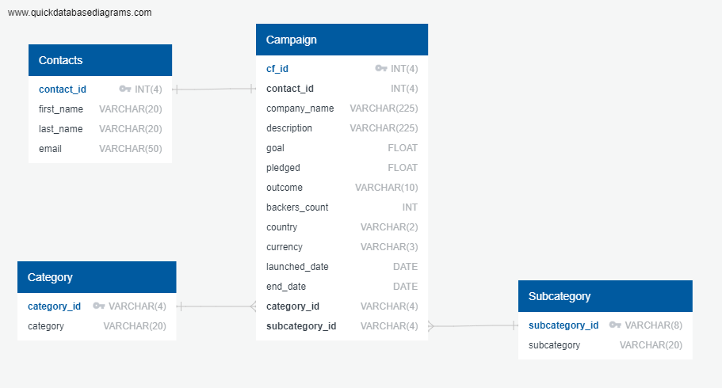

# Mod_13: ETL Crowdfunding Project

Collaborators: Shih-Hsien Ma and Chanelle Gonzalez

GitHub Repository: https://github.com/SH-Mars/Crowdfunding_ETL

Project Mission: Practice building ETL pipeline using Python, Pandas, Regular Expression to extract and transform Crowdfunding CSV data. Finally, create ERD and table schema to map and load data using Postgres.

Resources: contacts.xlsx, crowdfunding.xlsx, ETL_Mini_Project_starter_code.ipynb

Notebooks: Each collaborator completed their own notebook located in the Notebooks folder. Final submitted notebook – ETL_Mini_Project_Final.ipynb. 

Exports: category.csv, subcategory.csv, contacts.csv, campaign.csv

ERD: crowdfunding_db_schema.png

Database: crowdfunding_db_schema.sql

